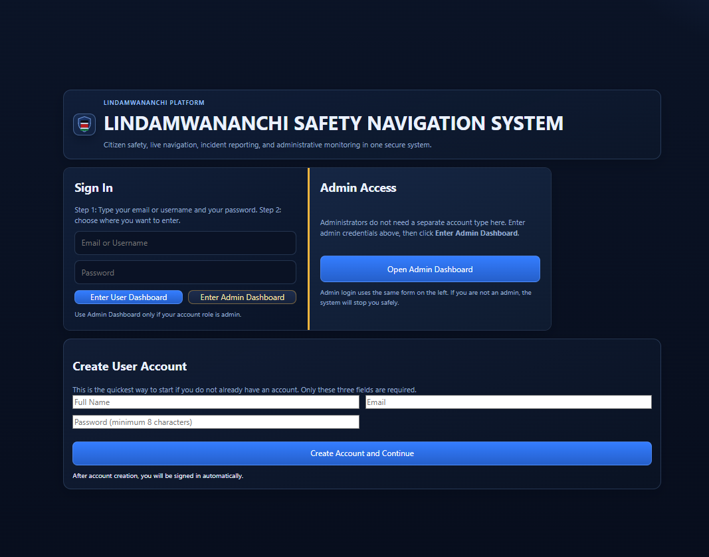
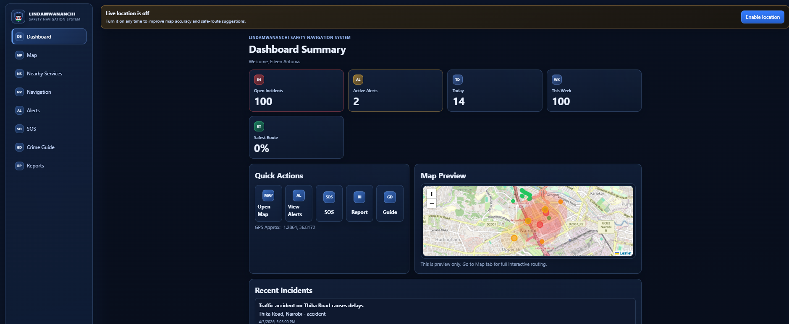
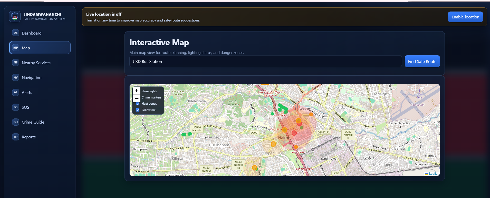
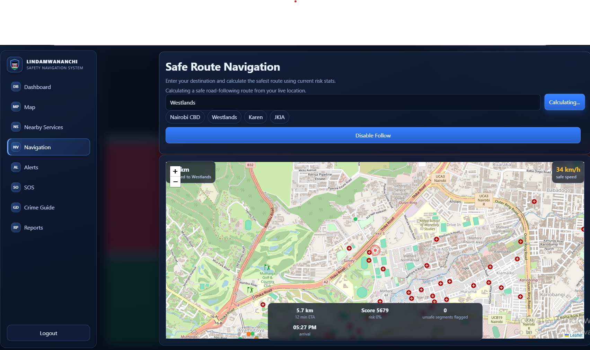
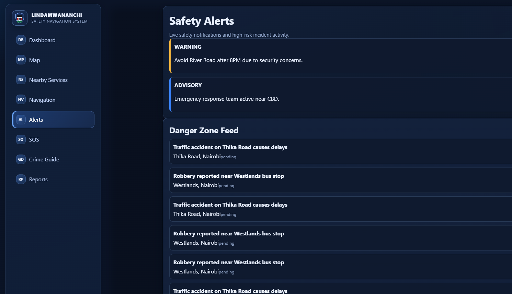
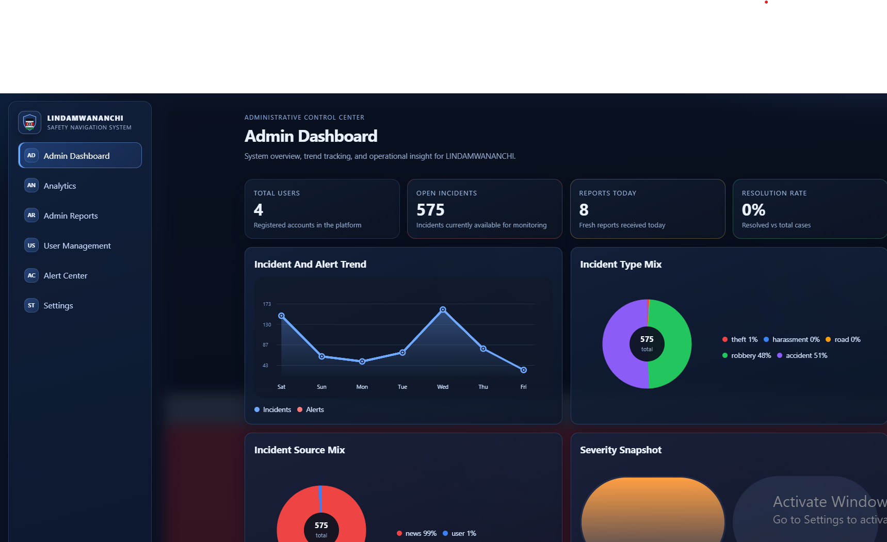

# LINDAMWANANCHI


A full-stack citizen safety and navigation platform designed to improve urban safety through incident reporting, intelligent route guidance, emergency support access, and administrative monitoring.

## Project Summary

LINDAMWANANCHI is a web-based public safety platform built to help citizens move more safely and make faster safety decisions. The system combines incident reporting, safety alerts, map-based navigation, nearby emergency service discovery, and SOS support in one centralized interface. It also includes an administrative workspace for monitoring reports, trends, and operational safety data.

This project demonstrates practical application of full-stack software engineering, REST API development, authentication, geospatial visualization, modular backend architecture, and database-driven workflows in a public safety context.

## Objectives

The project aims to:

- improve safety awareness for citizens
- support safer route planning and movement
- enable fast incident reporting
- provide access to nearby emergency support services
- offer administrators visibility into safety activity and reports
- demonstrate a real-world civic technology solution

## Features

### User Features

- Secure user registration and login
- Safety incident reporting
- Safety alerts and updates
- Interactive map view
- Route and navigation support
- Nearby hospitals and police stations
- SOS emergency support page
- Crime and safety awareness guide
- User reports dashboard

### Admin Features

- Admin dashboard and workspace separation
- Incident and report monitoring
- Alerts oversight
- Operational analytics support
- Intelligence and pipeline monitoring support

## Screenshots

### Login Page


### User Dashboard


### Map View


### Navigation Page


### Alerts Page


### Admin Dashboard


## Tech Stack

### Frontend

- Next.js
- React
- TypeScript
- Tailwind CSS
- Leaflet
- React Leaflet

### Backend

- Node.js
- Express.js
- TypeScript
- MySQL
- Zod
- JSON Web Tokens (JWT)

## System Architecture

The application is divided into two main components:

- `frontend` - a Next.js client application for users and administrators
- `backend` - an Express.js and TypeScript API for authentication, incidents, alerts, routes, reports, SOS services, map data, and supporting workflows

## Repository Structure

```text
linda-mwananchi-web/
|-- frontend/
|   |-- pages/
|   |-- COMPONENTS/
|   |-- CONTEXT/
|   |-- HOOKS/
|   |-- SERVICES/
|   |-- STYLES/
|
|-- backend/
|   |-- src/
|   |   |-- modules/
|   |   |-- config/
|   |   |-- middleware/
|   |   |-- routes/
|   |   |-- utils/
|
|-- screenshotslogin.png
|-- screenshotsdashboard.png
|-- screenshotsmap.png
|-- screenshotsnavigation.png
|-- screenshotsalerts.png
|-- screenshotsadmin-dashboard.png
|
|-- README.md
```

## Main Pages

- `/` - Dashboard
- `/login` - Authentication page
- `/map` - Safety map
- `/navigation` - Live navigation
- `/nearby` - Nearby emergency services
- `/alerts` - Safety alerts
- `/reports` - Reports dashboard
- `/sos` - SOS support
- `/guide` - Crime and safety awareness guide

## Backend Modules

- auth
- users
- incidents
- alerts
- routes
- reports
- sos
- map
- intel
- pipeline

Health endpoint:

- `GET /api/health`

## Installation and Setup

### 1. Clone the Repository

```bash
git clone https://github.com/your-username/linda-mwananchi-web.git
cd linda-mwananchi-web
```

### 2. Configure Backend Environment Variables

Create `backend/.env`:

```env
NODE_ENV=development
PORT=5000
DB_HOST=127.0.0.1
DB_PORT=3306
DB_USER=root
DB_PASSWORD=your_mysql_password
DB_NAME=lindamwananchi_safety
OPENROUTESERVICE_API_KEY=your_openrouteservice_api_key
MAPBOX_ACCESS_TOKEN=
JWT_SECRET=replace_with_a_long_secret_at_least_24_characters
JWT_EXPIRES_IN=7d
NEWS_API_KEY=
NEWS_API_BASE=https://newsapi.org/v2/everything
```

### 3. Configure Frontend Environment Variables

Create `frontend/.env.local`:

```env
NEXT_PUBLIC_API_BASE_URL=http://localhost:5000/api
```

### 4. Install Dependencies

Backend:

```bash
cd backend
npm install
```

Frontend:

```bash
cd frontend
npm install
```

## Running the Project Locally

Run the backend and frontend in separate terminals.

### Backend

```bash
cd backend
npm run build
npm run start
```

For development mode:

```bash
cd backend
npm run dev
```

### Frontend

```bash
cd frontend
npm run dev:clean
```

Or:

```bash
cd frontend
npm run dev
```

## Available Scripts

### Backend

- `npm run dev` - start backend in watch mode
- `npm run build` - compile TypeScript
- `npm run start` - run compiled backend
- `npm run check` - type-check backend
- `npm run seed:streetlights` - seed streetlight data

### Frontend

- `npm run dev` - start Next.js dev server
- `npm run clean` - clear `.next` cache
- `npm run dev:clean` - clear cache and start the dev server
- `npm run build` - production build
- `npm run start` - run production frontend
- `npm run lint` - lint the frontend

## Practical Use Case

LINDAMWANANCHI can serve as:

- a civic technology project
- a final year or academic software project
- a smart-city prototype
- a public safety information platform
- a full-stack portfolio project demonstrating frontend, backend, database, authentication, and map integration skills

## Notes

- Make sure MySQL is running before starting the backend.
- Update `DB_PASSWORD` to match your local MySQL setup.
- Add real API keys if you want route intelligence and news-based features to work fully.
- The frontend expects the backend to run on `http://localhost:5000`.

## Future Enhancements

- cloud deployment
- automated testing
- improved role-based permissions
- mobile optimization
- expanded analytics and reporting
- integration with live public safety data sources
- notification and alert subscriptions

## Author

**Mwihaki Muigai**
